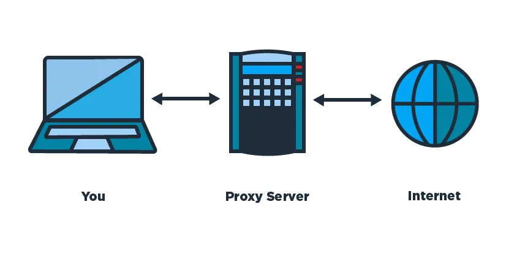
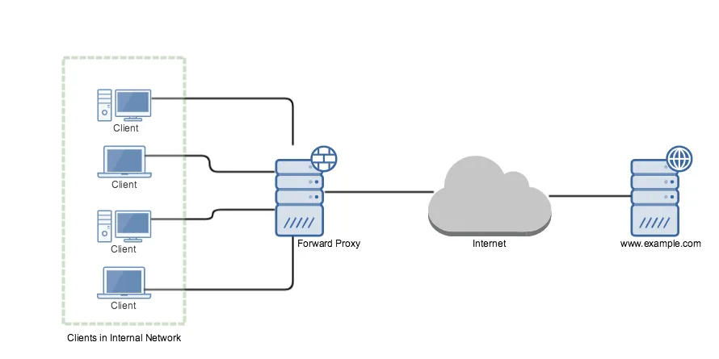
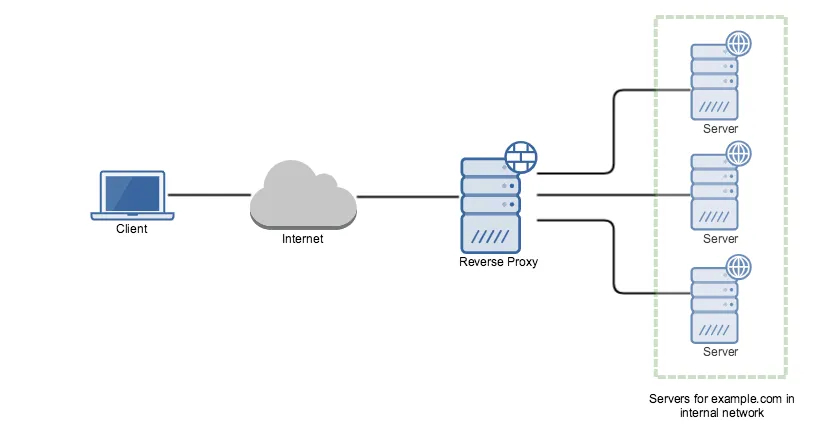

+++ 
draft = false
date = 2019-02-06T00:00:00-06:00
title = "What is proxy server?"
slug = "what-is-proxy-server"
tags = ["proxy", "system design", "Software development", "Software engineering"]
categories = ["system design"]
+++

Word `proxy` defines, someone or something acting on behalf of something else. In computer science proxy means one server acting on behalf of other servers. A proxy server is a server ( or computer system or an application) that acts as an intermediary for requests from clients seeking resources from other servers.

A client connects to the proxy server, requesting for some service (file, connection, web page) available from a different server and the proxy server evaluates the request as a way simplify and control it’s complexity. Proxies were invented to add structure and encapsulation to distributed systems.

> A proxy can be on the user’s local computer, or anywhere between the user’s computer and a destination server on the internet.

Proxy servers are used for different purpose like

* Blocking common internet services for a group of clients
* Caching web pages to improve network performance
* Load balancing the loads among multiple servers
* Frontend to control and protect access to a server on a private network
* Hide user’s IP address while browsing the internet

Basically there are two types of proxy servers

1. Forward Proxy or “Proxy” or “Gateway”
2. Reverse Proxy

## Forward Proxy

Most often when people talk about proxy server they commonly refer to forward proxy. A *forward proxy* is an internet facing proxy which provides services to a client or group of clients. Often, these clients are part of a common internal network.

In example, when one of these client makes connection attempt to www.example.com server for a web page, the request has to pass through the forward proxy server first. Depending on the forward proxy settings request can be allowed or denied. If allowed, the request is forwarded to www.example.com web server.

Web server sees that the request was sent by forward proxy server and while sending the response it addresses forward proxy server.When forward proxy receives the response, it recognizes it as the response to the request that went earlier and passes the response to the client who made the request.

Forward proxies are a single point for access and control, and makes it easier to enforce securities policies. Forward proxies are used by organizations, schools to enforce security, block access to certain contents on the internet for clients in the internal network. Requests may be filtered by several methods, such as a URL or DNS blacklists blacklist, URL regex filtering, MIME filtering, or content keyword filtering.

Forward proxies can also acts as a cache server in an internal network. If a resource is downloaded many times, then the proxy can cache the content on the server so that the next time when another client download the same content, the proxy will send the content that is previously stored on the server to the client.

Forward proxies can also acts as a cache server in an internal network. If a resource is downloaded many times, then the proxy can cache the content on the server so that the next time when another client download the same content, the proxy will send the content that is previously stored on the server to the client.

> There are likely hundreds of thousand of open forward proxies on the internet.

Some forward proxy softwares (on the server side) are:

* [PHP-Proxy](https://www.php-proxy.com/)
* [Cgi-proxy](https://www.jmarshall.com/tools/cgiproxy/)
* [glype](https://proxy.org/)
* [squid](http://www.squid-cache.org/) (apparently, can also work as a reverse proxy).

## Reverse Proxy
A reverse proxy does exact opposite of what forward proxy does. Forward proxy proxies on behalf of clients where reverse proxy proxies on behalf of severs. It is usually an internal-facing proxy used as a front-end to control and protect access to a server on a private network. All traffic coming from the Internet and with a destination of one of the servers goes through the proxy server.

It appears to clients to be an ordinary server. It accepts requests from external clients on behalf of the servers behind them and forwards the request to one or more servers to handle the request. The response from the proxy server is returned as if it came directly from the origin servers, leaving the client with no information about origin servers.

To the client in our example, it is reverse proxy that is providing the services for www.example.com. The client is unaware about the web servers behind the proxy which are actually providing the service.

> A forward proxy hides the identities of clients, whereas a reverse proxy hides identities of servers.

A reverse proxy is used for the following purpose:

*Encryption or SSL Acceleration*: When secure web sites are created, the secure sockets layer (SSL) encryption is often not done by the web server itself, but by a reverse proxy that is equipped with SSL acceleration hardware. A reverse proxy provides SSL encryption for an arbitrary number of host removing the need for separate SSL server certificate for each host.

*Load Balancing*: The reverse proxy can distribute the load to several web servers, each web server serving its own application area.

*Serve/cache static content*: A reverse proxy can offload the web servers by caching static content like pictures and other static graphical content.

*Compression*: the proxy server can optimize and compress the content to speed up the load time.

*Security*: the proxy server is an additional layer of defence and can protect against some OS and Web Server specific attacks.

Reverse proxy softwares for HTTP (server side):

* [Apache mod_proxy](https://cwiki.apache.org/confluence/display/COCOON/ApacheModProxySsl) (can also work as a forward proxy for HTTP)
* [Nginx](https://nginx.org/)
* [HAProxy](https://www.haproxy.org/)
* [Varnish Cache](https://varnish-cache.org/)
